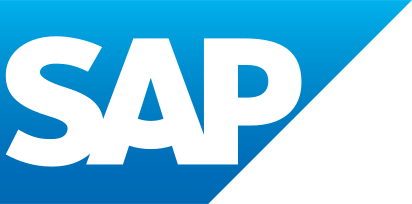
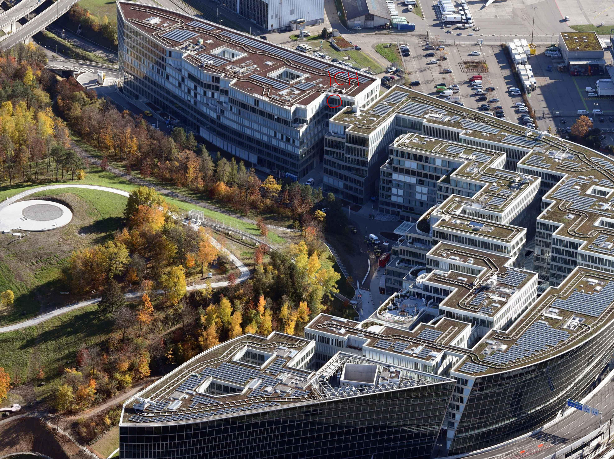

# Bericht von Linus zum 5W-Tag
Was wir wirklich wissen wollen

## Die Arbeit von meinem Papa
Heute bin ich mit Papa zur Arbeit gefahren. Mein Papa arbeitet in der Schweiz in der Nähe des Flughafens bei der Firma SAP:

SAP stellt Software her für Unternehmen. Es arbeiten heutzutage mehr als 105.000 Mitarbeiter bei SAP. Die Buchstaben SAP bedeuten: ¨**S**ystem**a**nalyse **P**rogrammentwicklung¨.

Mein Papa hilft den Benutzern der Software, wenn sie nicht funktioniert.

## Das Büro

Ich habe viele Dinge gesehen. Zum Beispiel:
* dass man im Raum vom Namen Neptun, malen kann auf der Tafel.
* dass es nebenan noch ein Krankenhaus gibt.
* das es eine Wand gibt mit Kugeln die magnetisch sind
* Es gibt ein Laufband, ich bin auf dem Laufband noch gelaufen
* dann hab ich noch einen grünen Raum gesehen mit einer blauen Decke, der Raum hat so ausgesehen wie die grüne Wiese und ein blauer Himmel
* Und ich habe noch gesehen dass die Leute die hier arbeiten, z.B. mein Papa, an Schreibtischen und Monitoren am Computer arbeiten, die sehr gross sind

## Meine Aufgabe
Ich muss einen Bericht schreiben mit Markdown, später laden wir ihn ins Internet hoch. Jetzt fühle Ich mich wie ein richtiger Büro-Arbeiter. 

## Das Essen 
Das Mittagessen hat mir gut geschmeckt, Ich hatte eine Pizza Margherita, Die Pizza hatte aber zu viel Käse drauf. 
es hat mit bis jetzt gut gefallen.

## Ein Bild vom Büro
